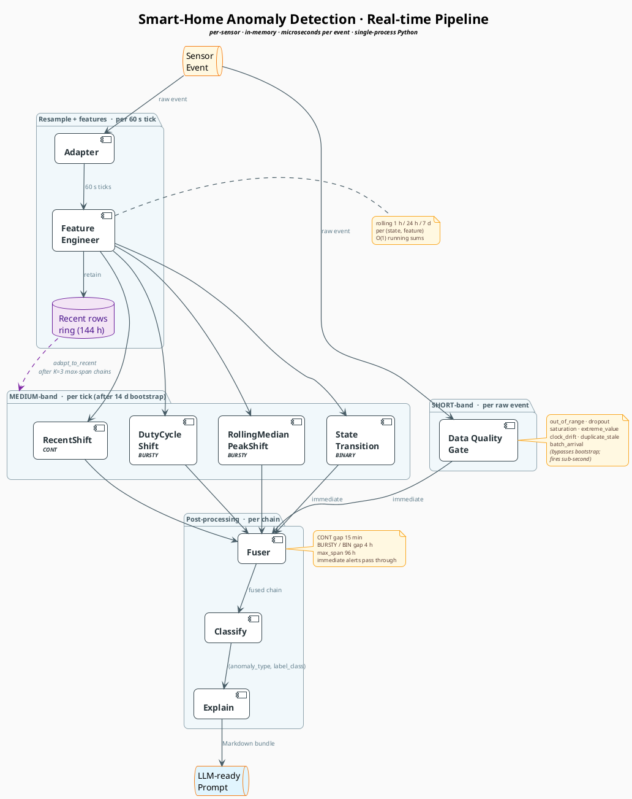

# Pipeline diagram + 120d PDF guide (temp)

Scratch doc with two deliverables in one place:

1. PlantUML script for the real-time pipeline diagram (copy-paste ready).
2. Page-by-page summary of the 120d household stakeholder PDF.

---

## 1. Real-time pipeline — PlantUML

### Design choice: lean diagram + companion table

Stuffing every parameter (cooldowns, fuser gaps, bootstrap rules,
archetype routing) into the diagram itself buries the topology in
walls of small text — the eye can't follow the flow anymore. Cleaner
pattern:

- **Diagram** answers *"how does data flow?"* — boxes, arrows, and
  one short label per edge for *what* moves between stages.
- **Table** answers *"what does each stage actually do?"* —
  parameters and decision rules, one row per stage.

Both live below.

### PlantUML script

Paste into <https://www.plantuml.com/plantuml> or any PlantUML
renderer. The four packages group stages by cadence (raw event →
tick → tick post-bootstrap → per chain). The dashed purple feedback
loop from the recent-rows ring shows the K=3 max-span streak adapt
mechanism — the only post-bootstrap re-fit path. Pipeline terminates
at the LLM-ready prompt; what the LLM consumer does with it is
downstream and out of scope.

### Companion stage-detail table

| Stage | Runs on | Key parameters | Output |
|---|---|---|---|
| **Data Quality Gate** | every raw event | `min_value` / `max_value` from config; cooldowns: OOR 30 min, dropout 30 min, batch 30 min, clock-drift 5 min | `out_of_range`, `dropout`, `saturation`, `extreme_value`, `clock_drift`, `duplicate_stale`, `batch_arrival` |
| **Adapter** | every raw event | tick = 60 s; gap > 5 × `expected_interval_sec` → tick flagged `dropout` | uniform 60 s tick stream; per-archetype state (CONT linear-interp; BURSTY k-means state; BINARY state hold) |
| **Feature Engineer** | every tick | rolling windows 1 h / 24 h / 7 d, per (state, feature); O(1) running sums | enriched tick = raw + `value_roll_*` for each numeric feature |
| **Detectors** | every tick (after 14 d bootstrap) | CONT → RecentShift; BURSTY → DutyCycleShift, RollingMedianPeakShift; BINARY → StateTransition | medium-band alerts with detector context |
| **Fuser** | every alert | gap = 15 min (CONT) or 4 h (BURSTY/BIN); `max_span` = 96 h; immediate alerts (DQG non-dropout, StateTransition) bypass | one fused chain per anomaly window with `first_fire_ts`, `fire_ticks`, detector union |
| **Classify** | per fused chain | decision tree on (detector signature, direction, calendar bucket, magnitude); pre-typed alerts pass through | `(anomaly_type, label_class)` |
| **Explain** | per chain | bundle assembled from chain + recent events; prompt rendered as Markdown | **LLM-ready Markdown prompt** (pipeline's terminal output — the LLM consumer is downstream and out of pipeline scope) |

---

## 2. 120d household PDF — page-by-page summary

Generated by `python -m anomaly viz`, lives at
`out/household_120d_report.pdf`. **11 pages** for this scenario.
Summaries below are read directly off the rendered PDF.

### Page 1 — Cover

**30 of 30 anomalies caught**, 120 d window (Feb 01 – May 31 2026).
Caught-by-type top six: level shift 5 · usage anomaly 4 · gradual drift
3 · freq change 3 · day pattern 3 · weekend pattern 3 · *+ 9 others*.
Timeline strip is all green dots, no red ×s. Footer:
*"~3 % of fires (2 of 76) were filtered as sensor noise."*

### Pages 2 – 9 — Showcase walkthroughs

Each page = one GT label rendered full-width, label region pink-tinted,
GT type and SYSTEM VERDICT printed top-right, green pin sitting on the
signal trace at the system's best-chain position.

- **p2 — Kettle outlet · Apr 12 – May 10 (28 d) · weekend pattern.**
  Verdict matches GT (✓). Caption: *"Kettle outlet ran heavily during
  this weekend."*
- **p4 — Mains voltage · Apr 20 – May 13 (23 d) · long-term shift.**
  Match (✓). Voltage band visibly steps down at label start, recovers
  at end — clean `RecentShift` catch.
- **p6 — Fridge outlet · Apr 5 – Apr 19 (14 d) · gradual degradation.**
  Match (✓) on a dense fridge-cycle trace; pin sits inside the label
  band on a typical peak.
- **p9 — TV outlet · Mar 26 – Mar 27 (24 h) · usage anomaly.**
  **Chain caught, type *mismatched*** — system inferred *time-of-day
  pattern* (verdict block rendered amber with `✗`). The pin is still
  green (chain-level TP credited to `incR`), but `tyAcc` would mark
  this wrong.

### Page 10 — Honest accounting (false alarms)

`MISSED` half is empty (zero misses this run). `FALSE ALARMS
(user-visible)` mini-multiples grid shows the first six FP chains —
three *Fridge outlet* tiles dated Feb 15 / Feb 15 / Feb 17 (weekend
pattern, level shift, level shift) — with a *"+ 38 more false alarms"*
overflow note. The trade-off is visible: zero misses cost ~40
user-visible FPs, mostly on the fridge.

### Page 11 — Appendix: *All incidents*

Header: `30 rows total — 30 caught, 0 missed`. Columns
**SENSOR · TYPE · WHEN · DURATION · RESULT** — every row green
`✓ caught`. Scrollable ledger so a stakeholder can verify nothing
was hidden.

---

### What does the green mark on the example graphs mean?

On each showcase page (p2 – p9) the small green dot sitting on the
signal trace inside the pink-tinted label band is the **best-chain
pin**. It marks **(when, signal-value)** of the system's earliest
detection chain that overlapped this GT label:

- **x** = `chain.start` (the chain's window_start) — *"when the system
  flagged it"*.
- **y** = the signal value at that timestamp — *"what the sensor was
  reading at fire time"*.

Pin colour is always green when drawn — its presence means the label
was caught. The right-side **SYSTEM VERDICT** block then tells you
whether the *type* the system inferred matches GT (green ✓) or
mismatches (amber ✗). p9 is the amber-✗ example: chain-level TP, type
miss.

On missed labels the pin is replaced by a red `NO SYSTEM FIRE`
callout. None of those exist in this run.

> **Note:** the cover-page bar-chart labels in this render still show
> slight left-edge clipping (e.g. *"level shift"* with the leading
> character cut). Fix queued on `fix/cover-bar-chart-trim`; the next
> render after that PR merges won't clip.
