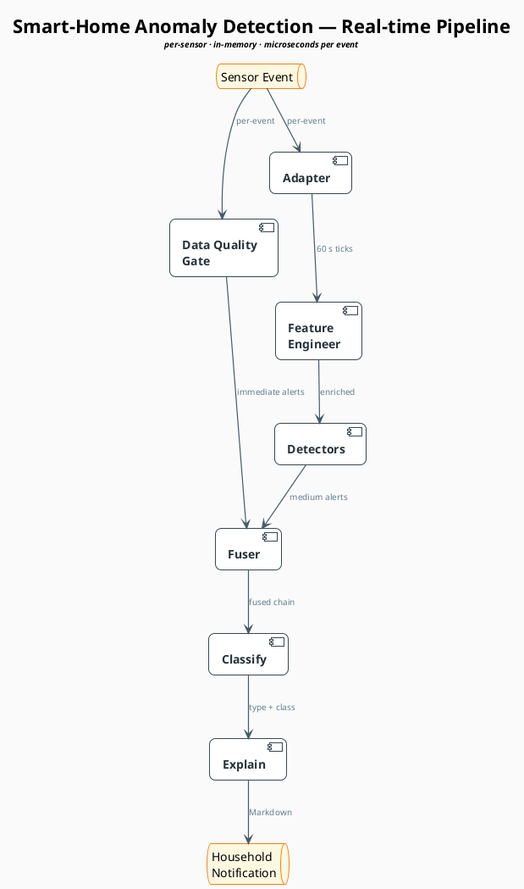

# Pipeline diagram + 120d PDF guide (temp)

Scratch doc with two deliverables in one place:

1. PlantUML script for the real-time pipeline diagram (copy-paste ready).
2. Page-by-page summary of the 120d household stakeholder PDF.

---

## 1. Real-time pipeline — PlantUML

### Design choice: lean diagram + companion table

Stuffing every parameter (cooldowns, fuser gaps, bootstrap rules,
archetype routing) into the diagram itself buries the topology in
walls of small text — the eye can't follow the flow anymore. Cleaner
pattern:

- **Diagram** answers *"how does data flow?"* — boxes, arrows, and
  one short label per edge for *what* moves between stages.
- **Table** answers *"what does each stage actually do?"* —
  parameters and decision rules, one row per stage.

Both live below.

### PlantUML script

Paste into <https://www.plantuml.com/plantuml> or any PlantUML
renderer. If your renderer crowds the layout, swap the two
`Event -->` lines for an explicit `Event -down-> DQG` /
`Event -down-> Adapter` to force vertical alignment.

### Companion stage-detail table

| Stage | Runs on | Key parameters | Output |
|---|---|---|---|
| **Data Quality Gate** | every raw event | `min_value` / `max_value` from config; cooldowns: OOR 30 min, dropout 30 min, batch 30 min, clock-drift 5 min | `out_of_range`, `dropout`, `saturation`, `extreme_value`, `clock_drift`, `duplicate_stale`, `batch_arrival` |
| **Adapter** | every raw event | tick = 60 s; gap > 5 × `expected_interval_sec` → tick flagged `dropout` | uniform 60 s tick stream; per-archetype state (CONT linear-interp; BURSTY k-means state; BINARY state hold) |
| **Feature Engineer** | every tick | rolling windows 1 h / 24 h / 7 d, per (state, feature); O(1) running sums | enriched tick = raw + `value_roll_*` for each numeric feature |
| **Detectors** | every tick (after 14 d bootstrap) | CONT → RecentShift; BURSTY → DutyCycleShift, RollingMedianPeakShift; BINARY → StateTransition | medium-band alerts with detector context |
| **Fuser** | every alert | gap = 15 min (CONT) or 4 h (BURSTY/BIN); `max_span` = 96 h; immediate alerts (DQG non-dropout, StateTransition) bypass | one fused chain per anomaly window with `first_fire_ts`, `fire_ticks`, detector union |
| **Classify** | per fused chain | decision tree on (detector signature, direction, calendar bucket, magnitude); pre-typed alerts pass through | `(anomaly_type, label_class)` |
| **Explain** | per chain | bundle assembled from chain + recent events; prompt rendered as Markdown | LLM-ready bundle for household notification |

---

## 2. 120d household PDF — page-by-page summary

The PDF is generated by `python -m anomaly viz` (lives at
`out/household_120d_report.pdf`). Stakeholder-facing: meant to be
readable without the codebase open.

### Page 1 — Cover

The single-glance verdict.

- **Eyebrow:** `120 DAYS · HOUSEHOLD` and the date range.
- **Hero metric:** big numeral showing **"X of Y anomalies caught"** —
  true positives over total ground-truth labels.
- **Caught by type:** horizontal bar chart of the top 6 detected
  anomaly types, with an *"… and others"* roll-up row when there are
  more.
- **Scenario timeline:** a strip plot from start to end of the 120-day
  window. Each ground-truth label appears as one marker:
  - **🟢 green dot** = caught.
  - **❌ red ×** = missed.
- **Suppression footer:** *"~X% of fires (N of M) were filtered as
  sensor noise — never reached the user."* — the scale of FP
  suppression relative to user-facing alert volume.

### Pages 2 – ~9 — Showcases (one per curated GT label, up to 8)

The "show me a few" gallery. Each page picks one GT label and walks
through what happened.

- **Verdict tag** — green `CAUGHT` or red `MISSED` ribbon, top-left.
- **Header:** friendly sensor name (*Fridge outlet*, *Mains voltage*,
  …) plus the date range.
- **Hero signal trace** — full-width plot of the raw signal across a
  window padded around the label. The label region is tinted so the
  eye locks onto the anomaly window.
- **Best-chain pin** *(caught only)* — callout pinned to the earliest
  in-label fire tick, naming the detector(s) that fired and the
  inferred type.
- **No-fire callout** *(missed only)* — red dashed marker explaining
  nothing fired.
- **Plain-English summary** at the bottom (e.g. *"Fridge outlet
  baseline shifted upward at the start of this period. Flagged as a
  level shift."*).

### Optional middle pages

These render only when content exists; otherwise they're skipped.

- **Honest accounting page** — appears only if there's at least one
  missed GT or one user-visible false alarm. Two tinted
  mini-multiple grids:
  - **Top:** *WHAT WE MISSED* — pink-tinted FN tiles.
  - **Bottom:** *FALSE ALARMS* — amber-tinted user-visible FP tiles.
- **Quietly suppressed page** — appears only when ≥ 50 fires were
  filtered as noise. Big number plus a per-sensor bar breakdown
  showing where suppression happened. Below 50, the count folds into
  the cover footer instead of getting its own page.

### Last page(s) — Appendix: *All incidents*

The full ledger, so a stakeholder can audit that nothing has been
hidden.

- One row per ground-truth label, caught rows sorted first.
- Columns: **SENSOR · TYPE · WHEN · DURATION · RESULT**.
- Result column: green **`✓ caught`** vs red **`× missed`** — same
  semantics as the green dot on the cover timeline.
- Auto-paginates at 40 rows per page; for 120d (~27 labels) it's one
  page.

---

### What does the green dot mean? (TL;DR)

Anywhere **green** appears in this report — the cover timeline dot,
the showcase `CAUGHT` ribbon, the appendix ✓ — it means **the system
produced at least one detection chain that overlapped a ground-truth
anomaly label**. That's the unit of success: a true positive at the
incident level. Red (×, `MISSED` ribbon) is its complement: a label
with zero overlapping detections.

The green dot does **not** mean *"perfectly classified"* or *"alerted
on time"*. It only means we noticed *something*. Type accuracy and
alert latency are separate metrics surfaced on the eval headline
(`tyAcc`, `onTime%`).
