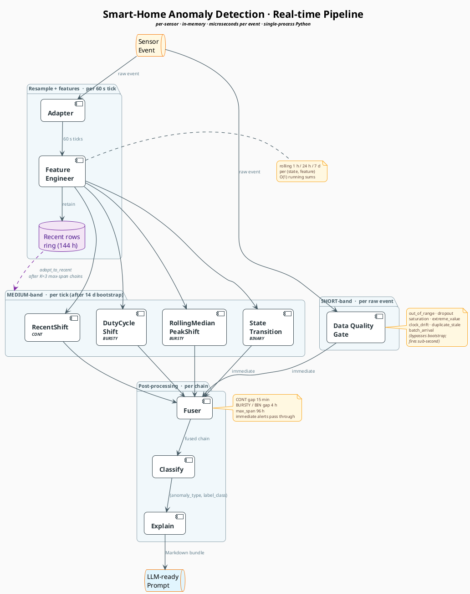

# Pipeline diagram + 120d PDF guide (temp)

Scratch doc with two deliverables in one place:

1. PlantUML script for the real-time pipeline diagram (copy-paste ready).
2. Page-by-page summary of the 120d household stakeholder PDF.

---

## 1. Real-time pipeline — PlantUML

### Design choice: lean diagram + companion table

Stuffing every parameter (cooldowns, fuser gaps, bootstrap rules,
archetype routing) into the diagram itself buries the topology in
walls of small text — the eye can't follow the flow anymore. Cleaner
pattern:

- **Diagram** answers *"how does data flow?"* — boxes, arrows, and
  one short label per edge for *what* moves between stages.
- **Table** answers *"what does each stage actually do?"* —
  parameters and decision rules, one row per stage.

Both live below.

### PlantUML script

Paste into <https://www.plantuml.com/plantuml> or any PlantUML
renderer. The four packages group stages by cadence (raw event →
tick → tick post-bootstrap → per chain). The dashed purple feedback
loop from the recent-rows ring shows the K=3 max-span streak adapt
mechanism — the only post-bootstrap re-fit path. Pipeline terminates
at the LLM-ready prompt; what the LLM consumer does with it is
downstream and out of scope.

### Companion stage-detail table

| Stage | Runs on | Key parameters | Output |
|---|---|---|---|
| **Data Quality Gate** | every raw event | `min_value` / `max_value` from config; cooldowns: OOR 30 min, dropout 30 min, batch 30 min, clock-drift 5 min | `out_of_range`, `dropout`, `saturation`, `extreme_value`, `clock_drift`, `duplicate_stale`, `batch_arrival` |
| **Adapter** | every raw event | tick = 60 s; gap > 5 × `expected_interval_sec` → tick flagged `dropout` | uniform 60 s tick stream; per-archetype state (CONT linear-interp; BURSTY k-means state; BINARY state hold) |
| **Feature Engineer** | every tick | rolling windows 1 h / 24 h / 7 d, per (state, feature); O(1) running sums | enriched tick = raw + `value_roll_*` for each numeric feature |
| **Detectors** | every tick (after 14 d bootstrap) | CONT → RecentShift; BURSTY → DutyCycleShift, RollingMedianPeakShift; BINARY → StateTransition | medium-band alerts with detector context |
| **Fuser** | every alert | gap = 15 min (CONT) or 4 h (BURSTY/BIN); `max_span` = 96 h; immediate alerts (DQG non-dropout, StateTransition) bypass | one fused chain per anomaly window with `first_fire_ts`, `fire_ticks`, detector union |
| **Classify** | per fused chain | decision tree on (detector signature, direction, calendar bucket, magnitude); pre-typed alerts pass through | `(anomaly_type, label_class)` |
| **Explain** | per chain | bundle assembled from chain + recent events; prompt rendered as Markdown | **LLM-ready Markdown prompt** (pipeline's terminal output — the LLM consumer is downstream and out of pipeline scope) |

---

## 2. 120d household PDF — page-by-page summary

Generated by `python -m anomaly viz`, lives at
`out/household_120d_report.pdf`. **12 pages** for this scenario.
Summaries below are read directly off the rendered PDF, not derived
from code.

### Page 1 — Cover (the single-glance verdict)

| | |
|---|---|
| **Window** | 120 DAYS · Feb 01 2026 – May 31 2026 |
| **Headline** | **26 of 35 anomalies caught** (74 % incident recall) |
| **Caught by type** | level shift 5 · gradual drift 3 · frequency change 3 · time-of-day pattern 3 · weekend pattern 3 · water leak 3 · *and 6 others* |
| **Timeline strip** | 35 markers along Feb→May. **🟢 green dots = 26 caught, ❌ red ×s = 9 missed.** Misses cluster around mid-Feb / early Mar / late May (visibly the bedroom-motion-sensor labels). |
| **Footer** | *"~99 % of fires (7,776 of 7,859) were filtered as sensor noise – never reached the user."* |

The cover sells one number: 26/35 caught with a 99 % noise-filter rate.
Read at a glance from across a room.

### Pages 2 – 9 — Showcase walkthroughs (8 total)

Each page is one curated GT label rendered full-width, with the label
region pink-tinted and a green pin marking the earliest correctly-typed
in-label fire. Examples observed:

- **p2 — `MISSED` · Bedroom motion sensor · Mar 7 – Mar 14 (168 h, *long-term shift*).**
  Barcode-style binary plot of motion/still over 8 days, label region
  tinted pink, red dashed `NO SYSTEM FIRE · This period was not
  detected.` callout. Caption: *"Bedroom motion sensor anomalies of type
  'long-term shift' rely on detectors not currently active for this
  sensor."* Honest about the coverage gap (motion sensor isn't in
  `household.yaml`).

- **p3 — `CAUGHT` · Kettle outlet · Apr 12 – May 10 (672 h, *time-of-day pattern*).**
  4-week BURSTY trace with the label band starting Apr 12. Green
  system-verdict pin lands around Apr 30 ("fired at 00:00 — outside
  typical hours"). Shows the detector picking up off-hours kettle use.

- **p5 — `CAUGHT` · Mains voltage · Apr 20 – May 13 (552 h, *long-term shift*).**
  CONTINUOUS noise floor visibly drops at the label start, recovers at
  the label end. Green pin marks the in-label fire ≈ Apr 22. Clean
  example of `RecentShift` catching a multi-week voltage offset.

- **p7 — `CAUGHT` · Fridge outlet · Apr 5 – Apr 19 (336 h, *time-of-day pattern*).**
  Dense fridge-cycle trace; label band over 2 weeks. Green pin lands
  ~Apr 14 with verdict "time-of-day pattern".

These four cover the full range: a `MISSED` (architectural blind spot),
a calendar-pattern catch on a BURSTY appliance, a level-shift catch on
a CONTINUOUS sensor, and another BURSTY calendar-pattern catch.

### Pages 10 – 11 — Honest accounting + Suppression

- **p10 — Honest accounting** *(rendered because there are missed GTs
  and at least some user-visible FPs).* Top "MISSED" grid: 3 pink
  bedroom-motion-sensor tiles (Feb 17 *unusual occupancy*, Mar 7
  *long-term shift*, Mar 25 *unusual occupancy*). Lower "FALSE ALARMS"
  amber band visible.

- **p11 — Quietly suppressed: `7,776`.** Per-sensor bar breakdown:
  **kettle outlet 4,047 · TV outlet 3,710 · fridge outlet 19.**
  Italic note: *"None of these reach the user dashboard."* Demonstrates
  the noise filter's value: ~99 % of raw fires are silenced before
  becoming notifications, almost entirely on the chatty BURSTY outlets.

### Page 12 — Appendix: *All incidents*

The full ledger. Header reads `35 rows total — 26 caught, 9 missed`.
Columns: **SENSOR · TYPE · WHEN · DURATION · RESULT**. Caught rows
sorted first (green ✓), then missed rows (red ×). Stakeholder can scan
the whole list and verify nothing was hidden — every label from the
synth-gen scenario is accounted for, with each result colour-coded.

---

### What does the green dot mean?

Green appears in **two related but distinct** places in this report:

1. **Cover timeline strip (p1):** each green dot = one GT label that
   was caught (≥ 1 detection chain overlapped it). Red × = a GT label
   with zero overlapping detections.
2. **Showcase pages (p3, p5, p7, …):** the single green pin inside the
   pink label band = the earliest in-label fire tick from the system's
   best chain — i.e. **when** the system noticed, anchored on the
   signal trace.

In both cases green denotes the unit of success — a **true positive at
the incident level**. It does **not** mean *"perfectly classified"* or
*"alerted on time"*. Type accuracy and alert latency are separate
metrics surfaced on the eval headline (`tyAcc`, `onTime%`).

> **Note:** the cover-page bar-chart labels in this rendering of the
> PDF show slight left-edge clipping (e.g. *"level shift"* renders as
> "level shift" with the leading character partly trimmed). That's the
> bug fixed on `fix/cover-bar-chart-trim`; the next render will not
> clip.
